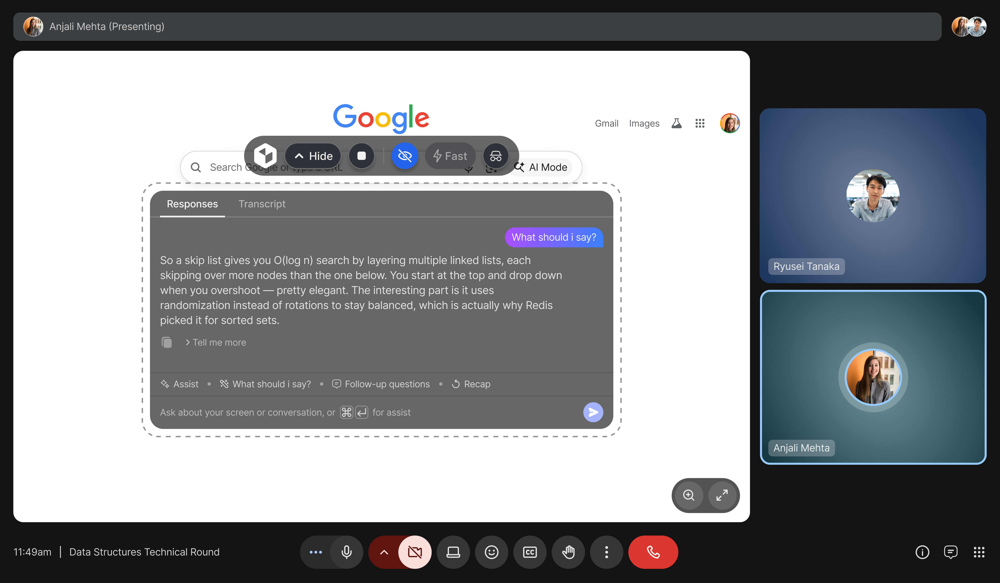
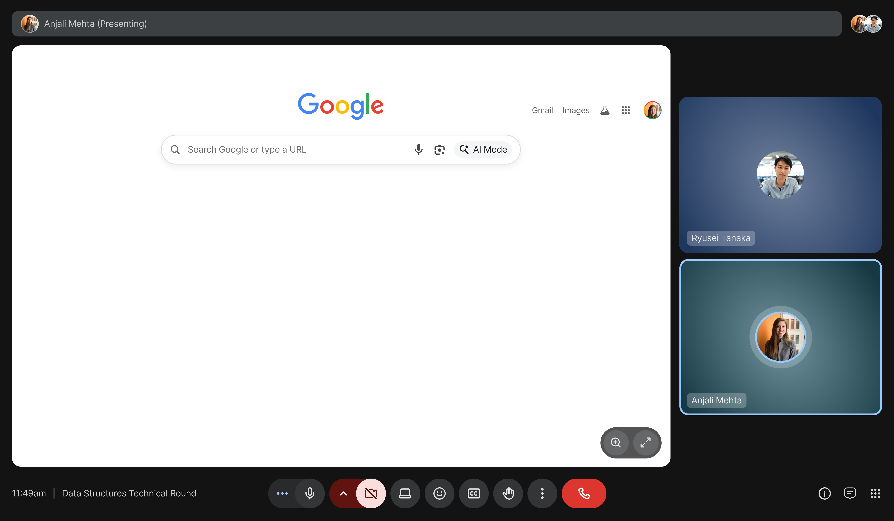

<p align="center">
  
</p>

<p align="center">
  <strong>Open-source, AI-powered meeting copilot with real-time transcription and echo cancellation.</strong>
</p>

Raven captures system audio and microphone during meetings, cancels echo so speaker audio doesn't bleed into your mic, transcribes both sides of the conversation in real-time via Deepgram, and gives you AI assistance (Claude or OpenAI) with context-aware responses - all running locally on your desktop.

<p align="center">
  <a href="https://useraven.ai"><strong>Download Raven</strong></a> &nbsp;|&nbsp;
  <a href="https://docs.useraven.ai"><strong>Documentation</strong></a> &nbsp;|&nbsp;
  <a href="https://github.com/Laxcorp-Research/project-raven/issues"><strong>Issues</strong></a>
</p>

---

## Screenshots

<table>
<tr>
<td width="50%">

**Dashboard — Session History**


</td>
<td width="50%">

**Settings — API Keys**


</td>
</tr>
<tr>
<td>

**Stealth Mode OFF — Overlay visible to screen share**


</td>
<td>

**Stealth Mode ON — Overlay invisible to screen share**


</td>
</tr>
<tr>
<td>

**Settings — Model Selection**


</td>
<td>

**Onboarding — Overlay Tour**


</td>
</tr>
</table>

<details>
<summary>Full onboarding flow (6 steps)</summary>

| Step 1: Welcome | Step 2: API Keys | Step 3: Permissions |
|---|---|---|
|  |  |  |

| Step 4: Overlay Tour | Step 5: Shortcuts | Step 6: Ready to Go |
|---|---|---|
|  |  |  |

</details>

---

## Features

- **Dual-stream audio capture** — System audio + microphone, captured natively on macOS (ScreenCaptureKit) and Windows (WASAPI)
- **Echo cancellation** — GStreamer pipeline using the WebRTC AEC3 engine (the same echo canceller used in Chrome)
- **Real-time transcription** — Deepgram Nova-3 over WebSocket with separate connections for mic and system audio
- **AI assistance** — Anthropic Claude or OpenAI, user-configurable via a provider pattern
- **Stealth overlay** — Invisible to Zoom, Meet, Teams, and Discord screen sharing
- **Local-first** — Your API keys and data stay on your machine (SQLite via better-sqlite3)
- **RAG** — Upload local documents, embedded with `@xenova/transformers`, and reference them in AI context
- **Sessions** — Auto-saved with full transcript, AI responses, and summaries
- **Modes** — Customizable AI behavior profiles with system prompts and quick actions
- **Profile picture editor** — Crop, zoom, and pan before saving your avatar
- **Pro features** — Optional auth, billing, and sync for a paid tier (connects to a separate backend)

## Architecture


## How It Works

1. User starts a recording session
2. A native binary captures system audio and microphone simultaneously
   - **macOS:** Swift process using ScreenCaptureKit (system) + CoreAudio (mic)
   - **Windows:** Rust/NAPI-RS module using WASAPI loopback + capture
3. Both streams are fed into a GStreamer echo-cancellation pipeline (`webrtcechoprobe` / `webrtcdsp`) so the remote speaker's voice doesn't contaminate the mic signal
4. The clean mic audio and system audio are sent over two parallel WebSocket connections to Deepgram Nova-3 for transcription
5. Transcripts appear in real-time in the overlay window
6. The user can ask AI (Claude or OpenAI) for help, with full conversation context

## Project Structure

```
src/
├── main/                  # Electron main process
│   ├── audioManager.ts    #   Audio capture orchestration
│   ├── transcriptionService.ts  #   Deepgram WebSocket connections
│   ├── aiService.ts       #   AI provider abstraction (Claude / OpenAI)
│   ├── sessionManager.ts  #   Session persistence & history
│   ├── store.ts           #   SQLite database (better-sqlite3)
│   └── index.ts           #   App lifecycle, IPC handlers, windows
├── renderer/              # React UI (Vite + Tailwind)
│   └── src/
│       ├── components/    #   Dashboard, overlay, settings, onboarding
│       └── ...
├── preload/               # Electron preload scripts (context bridge)
└── native/
    ├── swift/             # macOS audio capture (ScreenCaptureKit + CoreAudio)
    │   └── AudioCapture/
    ├── windows/           # Windows audio capture (WASAPI, Rust/NAPI-RS)
    └── aec/               # GStreamer AEC C++ addon (WebRTC AEC3)
```

## Platform Support

| Platform | System Audio | Microphone | Echo Cancellation | Status |
|----------|-------------|------------|-------------------|--------|
| **macOS 12+** | ScreenCaptureKit | CoreAudio | GStreamer AEC3 | Primary, fully tested |
| **Windows 10/11** | WASAPI Loopback | WASAPI Capture | GStreamer AEC3 | Supported |
| Linux | — | — | — | Not yet supported |

## Getting Started

This section is a complete, linear walkthrough — from a fresh machine to a running app. Pick your platform, follow every numbered step in order, and verify each one before moving on.

> **API keys** (entered in-app on first launch — nothing to configure beforehand):
>
> - [Deepgram](https://console.deepgram.com) — real-time transcription (free tier available)
> - [Anthropic](https://console.anthropic.com) or [OpenAI](https://platform.openai.com) — AI assistance
>
> This guide covers the open-source app. For the premium/pro mode setup, see [`docs/REPO_STRUCTURE.md`](docs/REPO_STRUCTURE.md).

---

### macOS Setup

> Tested on macOS 12 (Monterey) through macOS 15 (Sequoia), Intel and Apple Silicon.

**Step 1 — Install Xcode Command Line Tools**

```bash
xcode-select --install
```

A system dialog will appear — click **Install** and wait for it to finish (~2 min).

Verify:
```bash
xcode-select -p
# Expected: /Library/Developer/CommandLineTools  (or an Xcode.app path)
```

> **If you see** `xcode-select: error: command line tools are already installed` — you're good, move on.

---

**Step 2 — Install Node.js 22**

Install via [nvm](https://github.com/nvm-sh/nvm) (recommended). Skip the `curl` line if you already have nvm.

```bash
curl -o- https://raw.githubusercontent.com/nvm-sh/nvm/v0.40.1/install.sh | bash
```

**Close and reopen your terminal**, then:

```bash
nvm install 22
nvm use 22
```

Verify:
```bash
node -v
# Expected: v22.x.x (any 22+ version)
```

> **If `nvm: command not found`:** Close your terminal and open a new one — nvm's install script adds itself to your shell profile, but only new shells pick it up.

---

**Step 3 — Install GStreamer**

```bash
brew install gstreamer gst-plugins-base gst-plugins-good gst-plugins-bad
```

> Don't have Homebrew? Install it first from [brew.sh](https://brew.sh).

Verify:
```bash
pkg-config --modversion gstreamer-1.0
# Expected: 1.24.x (or similar)
```

> **If `Package gstreamer-1.0 was not found`:** Homebrew's `pkg-config` path isn't set. Add the correct line to your `~/.zshrc` and restart your terminal:
> ```bash
> # Apple Silicon (M1/M2/M3/M4):
> echo 'export PKG_CONFIG_PATH="/opt/homebrew/lib/pkgconfig:$PKG_CONFIG_PATH"' >> ~/.zshrc
>
> # Intel Mac:
> echo 'export PKG_CONFIG_PATH="/usr/local/lib/pkgconfig:$PKG_CONFIG_PATH"' >> ~/.zshrc
> ```

---

**Step 4 — Clone the repo and install dependencies**

```bash
git clone https://github.com/Laxcorp-Research/project-raven.git
cd project-raven
npm install
```

`npm install` takes a few minutes. It automatically rebuilds `better-sqlite3` for Electron via the `postinstall` script — you'll see `@electron/rebuild` output near the end.

Verify:
```bash
ls node_modules/.package-lock.json && echo "OK"
# Expected: OK
```

> **If `npm install` fails with `node-gyp` errors:** Make sure Xcode Command Line Tools installed successfully in Step 1. Run `xcode-select -p` to confirm.

---

**Step 5 — Build the GStreamer echo-cancellation addon**

```bash
cd src/native/aec
npm install
./build-deps.sh
npx cmake-js compile
cd ../../..
```

What this does:
1. Installs the addon's build tools (`cmake-js`, `node-addon-api`)
2. Verifies all GStreamer libraries and builds the WebRTC DSP plugin from source (Homebrew doesn't ship it)
3. Compiles the C++ echo-cancellation native module

Verify:
```bash
ls src/native/aec/build/Release/raven-aec.node && echo "OK"
# Expected: OK
```

> **If `build-deps.sh` fails with "gstreamer-1.0 not found":** Revisit Step 3 and make sure `pkg-config --modversion gstreamer-1.0` works.
>
> **If `cmake-js compile` fails with "cmake not found":** cmake is bundled with cmake-js. Run `npx cmake-js --version` — if that fails, delete `node_modules` inside `src/native/aec/` and re-run `npm install`.

---

**Step 6 — Build the Swift audio capture binary**

```bash
cd src/native/swift/AudioCapture
swift build -c release
cd ../../../..
```

Verify:
```bash
ls src/native/swift/AudioCapture/.build/release/audiocapture && echo "OK"
# Expected: OK
```

> **If `swift build` fails with unresolved imports:** Your Swift toolchain may be too old (5.9+ required). Check with `swift --version`. Update Xcode Command Line Tools:
> ```bash
> sudo rm -rf /Library/Developer/CommandLineTools && xcode-select --install
> ```

---

**Step 7 — Run the app**

```bash
npm run dev
```

The Electron app opens. On first launch you'll be prompted to enter your API keys in the settings.

> **If the app starts but audio capture doesn't work:** macOS requires explicit permissions. Go to **System Settings → Privacy & Security** and grant both **Microphone** and **Screen Recording** access to the app (or to your terminal emulator during development).

---

### Windows Setup

> Tested on Windows 10 (21H2+) and Windows 11. All commands are for **PowerShell**. Open a **new terminal** after each installer to pick up PATH changes.

**Step 1 — Install Visual Studio Build Tools**

Download and run the [Visual Studio Build Tools installer](https://visualstudio.microsoft.com/visual-cpp-build-tools/).

In the installer, check the **"Desktop development with C++"** workload and click Install. Make sure these optional components are selected (they should be by default):
- MSVC Build Tools for x64/x86 (Latest)
- Windows 10/11 SDK
- C++ CMake tools for Windows

Verify:
```powershell
& "${env:ProgramFiles(x86)}\Microsoft Visual Studio\Installer\vswhere.exe" -products * -requires Microsoft.VisualStudio.Workload.VCTools -property displayName
# Expected: Visual Studio Build Tools 2022
```

> **If you have full Visual Studio** (not just Build Tools) with the C++ workload, that works too.

---

**Step 2 — Install Node.js (LTS)**

Option A — [nvm-windows](https://github.com/coreybutler/nvm-windows/releases) (recommended):

Download and run the latest `nvm-setup.exe`, then open a **new** terminal:

```
nvm install 22
nvm use 22
```

Option B — Download the LTS 22.x MSI installer directly from [nodejs.org](https://nodejs.org/).

Verify (in a **new** terminal):
```
node -v
# Expected: v22.x.x
```

> **Why Node 22 specifically?** The project requires `node >= 22.12.0` (see `package.json` engines). Using `nvm install lts` may install a newer major version that hasn't been tested.

---

**Step 3 — Install Python**

Python is required by `node-gyp` to compile native Node.js modules (`better-sqlite3`, `bufferutil`, etc.).

Option A — [winget](https://learn.microsoft.com/en-us/windows/package-manager/winget/):
```
winget install Python.Python.3.12 --source winget
```

Option B — Download from [python.org](https://www.python.org/downloads/). Make sure "Add to PATH" is checked during installation.

Verify (in a **new** terminal):
```
python --version
# Expected: Python 3.x.x
```

---

**Step 4 — Install the Rust toolchain**

Download and run [rustup-init.exe](https://rustup.rs/). Accept the defaults (installs `stable-msvc`).

Verify (in a **new** terminal):
```
rustc --version
# Expected: rustc 1.xx.x (...)
rustup default stable-msvc
```

---

**Step 5 — Install GStreamer (MSVC)**

Download the **MSVC x86_64** installer from [gstreamer.freedesktop.org/download](https://gstreamer.freedesktop.org/download/) — click **Windows** → **MSVC x86_64 (VS 2022, Release CRT)**.

> For GStreamer 1.28+, there is a single combined installer (runtime + development). For older versions, download both the Runtime and Development MSI files.

Run with default settings. The installer typically installs to `C:\gstreamer\` or `C:\Program Files\gstreamer\`.

After installation, verify the environment variable is set (open a **new** terminal):
```powershell
echo $env:GSTREAMER_1_0_ROOT_MSVC_X86_64
# Expected: C:\gstreamer\1.0\msvc_x86_64\ (or C:\Program Files\gstreamer\1.0\msvc_x86_64\)
```

Also make sure GStreamer's `bin` directory is on your PATH:
```powershell
$gstRoot = $env:GSTREAMER_1_0_ROOT_MSVC_X86_64
if ($gstRoot) { echo "GStreamer root: $gstRoot" } else { echo "NOT SET - see below" }
```

> **If the variable is empty:** The installer didn't set it. Find where GStreamer was installed and set it manually:
> ```powershell
> # Adjust the path below to match your installation
> [Environment]::SetEnvironmentVariable("GSTREAMER_1_0_ROOT_MSVC_X86_64", "C:\Program Files\gstreamer\1.0\msvc_x86_64\", "User")
> ```
> Then **restart your terminal**.
>
> **If GStreamer installed to `C:\Program Files\gstreamer\` instead of `C:\gstreamer\`:** That's fine — just make sure the environment variable points to the correct path (e.g. `C:\Program Files\gstreamer\1.0\msvc_x86_64\`).

---

**Step 6 — Install CMake**

CMake is required to compile the GStreamer echo-cancellation addon.

```
winget install Kitware.CMake --source winget
```

Or download from [cmake.org/download](https://cmake.org/download/). Make sure "Add to PATH" is checked.

Verify (in a **new** terminal):
```
cmake --version
# Expected: cmake version 3.x.x
```

---

**Step 7 — Clone the repo and install dependencies**

```
git clone https://github.com/Laxcorp-Research/project-raven.git
cd project-raven
npm install
```

`npm install` takes a few minutes. It automatically rebuilds `better-sqlite3` for Electron via the `postinstall` script.

Verify:
```powershell
Test-Path node_modules\.package-lock.json
# Expected: True
```

> **If `npm install` fails with `Could not find any Python installation`:** Revisit Step 3 — Python must be installed and on PATH.
>
> **If `npm install` fails with `Could not find any Visual Studio installation`:** `node-gyp` can't auto-detect your Build Tools. Try these fixes in order:
> ```powershell
> # Fix 1: Set the version hint for node-gyp
> npm config set msvs_version 2022
> Remove-Item -Recurse -Force node_modules
> npm install
> ```
> If `npm config set msvs_version` gives an error on newer npm versions, use the environment variable instead:
> ```powershell
> # Fix 2: Environment variable (works on all npm versions)
> $env:GYP_MSVS_VERSION = "2022"
> Remove-Item -Recurse -Force node_modules
> npm install
> ```

---

**Step 8 — Build the GStreamer echo-cancellation addon**

First, check the Electron version used by the project:
```
node -e "console.log(require('./node_modules/electron/package.json').version)"
# Note the version (e.g. 40.4.1)
```

Then build the addon targeting that version:
```
cd src\native\aec
npm install
npx cmake-js compile --runtime electron --runtime-version <ELECTRON_VERSION>
cd ..\..\..
```

Replace `<ELECTRON_VERSION>` with the version from the previous command (e.g. `40.4.1`).

> **Important:** The `--runtime electron --runtime-version` flags are required. Without them, the addon is built for Node.js instead of Electron, and it **will crash** when loaded. If you upgrade Electron later, you must rebuild this addon with the new version.
>
> **Note:** The `build-deps.sh` script is macOS-only. On Windows, the GStreamer MSVC installer already includes all required plugins (including WebRTC DSP).

Verify:
```powershell
Test-Path src\native\aec\build\Release\raven-aec.node
# Expected: True
```

> **If cmake-js fails with "CMake is not installed":** Revisit Step 6.
>
> **If cmake-js fails with "GStreamer not found":** The `GSTREAMER_1_0_ROOT_MSVC_X86_64` environment variable is not set. Revisit Step 5.
>
> **If the build succeeds but linking fails with "unresolved external symbol `g_object_set` / `g_type_check_instance_cast`":** GLib/GObject libraries are missing from the link step. This should be handled automatically by the CMakeLists.txt — if you see this error, file a bug.

---

**Step 9 — Build the Windows audio capture module**

```
cd src\native\windows
npm install
npx napi build --platform --release
cd ..\..\..
```

Verify:
```powershell
Test-Path src\native\windows\raven-windows-audio.win32-x64-msvc.node
# Expected: True
```

> **If the build fails with linker errors:** Make sure Rust is using the MSVC target: `rustup default stable-msvc`.
>
> **If it fails with "Windows SDK not found":** Open **Visual Studio Installer → Modify → Individual components** and install the latest "Windows 10 SDK" or "Windows 11 SDK".

---

**Step 10 — Run the app**

```
npm run dev
```

The Electron app opens. On first launch you'll see a 6-step onboarding flow — enter your API keys (Deepgram for transcription, Claude or OpenAI for AI assistance).

> **If the app starts but audio capture doesn't work:** Check **Settings → Sound** and make sure the correct playback and recording devices are set as default. WASAPI captures from the default devices.

---

### Setup Troubleshooting Quick Reference

| Symptom | Likely Cause | Fix |
|---------|-------------|-----|
| `Could not find any Python installation` | Python not installed | Install Python 3.x and add to PATH (Windows Step 3) |
| `Could not find any Visual Studio installation to use` | `node-gyp` can't auto-detect Build Tools | Set `$env:GYP_MSVS_VERSION = "2022"`, delete `node_modules`, re-run `npm install` |
| `npm install` fails with `node-gyp` errors | Missing C/C++ build tools | **macOS:** `xcode-select --install` **Windows:** VS Build Tools "Desktop development with C++" workload |
| `NODE_MODULE_VERSION mismatch` at runtime | Native module built for wrong Electron version | `npx @electron/rebuild -f -w better-sqlite3` from the project root |
| `build-deps.sh`: "gstreamer-1.0 not found" | GStreamer not installed or `pkg-config` can't find it | **macOS:** Install via Homebrew and check `PKG_CONFIG_PATH` (see macOS Step 3) |
| cmake-js: "CMake is not installed" | CMake not on PATH | Install CMake (Windows Step 6) |
| cmake-js: "GStreamer not found" on Windows | `GSTREAMER_1_0_ROOT_MSVC_X86_64` not set | Set the env var manually and restart terminal (see Windows Step 5) |
| AEC addon crashes Electron on startup | Built for Node.js instead of Electron | Rebuild with `--runtime electron --runtime-version <your-electron-version>` (Windows Step 8) |
| `swift build` fails | Swift toolchain too old (need 5.9+) | `sudo rm -rf /Library/Developer/CommandLineTools && xcode-select --install` |
| `napi build` linker errors on Windows | Wrong Rust target or missing Windows SDK | `rustup default stable-msvc` and ensure VS Build Tools C++ workload is installed |
| App starts, no audio on macOS | Missing system permissions | **System Settings → Privacy & Security**: grant **Microphone** and **Screen Recording** |
| App starts, no audio on Windows | Wrong default audio device | **Settings → Sound**: set correct default playback/recording devices |

## Keyboard Shortcuts

| Action | Shortcut |
|--------|----------|
| Toggle Overlay | `Cmd + \` |
| Start/Stop Recording | `Cmd + R` |
| Get AI Suggestion | `Cmd + Enter` |
| Clear Conversation | `Cmd + Shift + R` |
| Move Overlay | `Cmd + Arrow Keys` |
| Scroll Overlay | `Cmd + Shift + Up/Down` |

> On Windows, replace `Cmd` with `Ctrl`.

## Testing

```bash
npm test              # Unit + integration tests
npm run test:coverage # With coverage report
npm run test:e2e      # End-to-end (requires npm run build first)
npm run test:all      # Everything
```

## Troubleshooting

**`better-sqlite3` native module error:**

The `postinstall` script handles this automatically. If you still see `NODE_MODULE_VERSION` mismatch errors:

```bash
npx @electron/rebuild -f -w better-sqlite3
```

**Reset all data (fresh start):**

```bash
# macOS
rm -rf ~/Library/Application\ Support/project-raven/

# Windows
rmdir /s /q "%APPDATA%\project-raven"
```

## Contributing

Issues and pull requests are welcome. This project is in active development.

1. Fork the repo
2. Create your feature branch (`git checkout -b feature/my-feature`)
3. Commit your changes (`git commit -m 'Add my feature'`)
4. Push to the branch (`git push origin feature/my-feature`)
5. Open a pull request

## License

[MIT](LICENSE)
