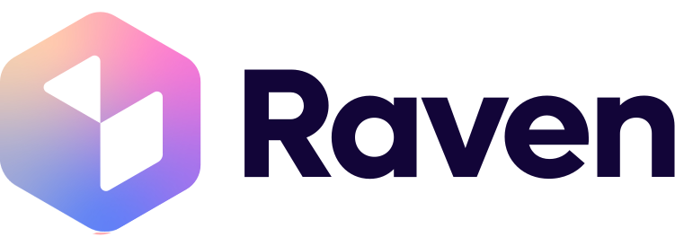
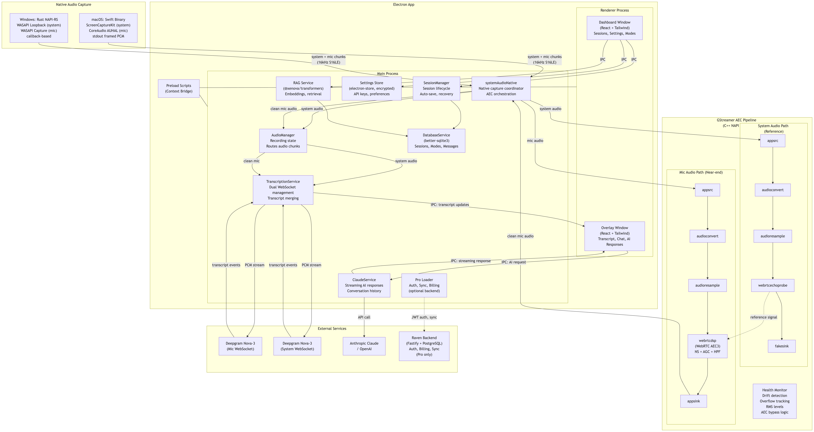

<p align="center">
  
</p>

<p align="center">
  <strong>Open-source, AI-powered meeting copilot with real-time transcription and echo cancellation.</strong>
</p>

Raven captures system audio and microphone during meetings, cancels echo so speaker audio doesn't bleed into your mic, transcribes both sides of the conversation in real-time via Deepgram, and gives you AI assistance (Claude or OpenAI) with context-aware responses — all running locally on your desktop.

---

## Features

- **Dual-stream audio capture** — System audio + microphone, captured natively on macOS (ScreenCaptureKit) and Windows (WASAPI)
- **Echo cancellation** — GStreamer pipeline using the same WebRTC AEC3 engine that powers Chrome, Recall.ai, and Cluely
- **Real-time transcription** — Deepgram Nova-3 over WebSocket with separate connections for mic and system audio
- **AI assistance** — Anthropic Claude or OpenAI, user-configurable via a provider pattern
- **Stealth overlay** — Invisible to Zoom, Meet, Teams, and Discord screen sharing
- **Local-first** — Your API keys and data stay on your machine (SQLite via better-sqlite3)
- **RAG** — Upload local documents, embedded with `@xenova/transformers`, and reference them in AI context
- **Sessions** — Auto-saved with full transcript, AI responses, and summaries
- **Modes** — Customizable AI behavior profiles with system prompts and quick actions
- **Pro features** — Optional auth, billing, and sync for a paid tier (connects to a separate backend)

## Architecture



## How It Works

1. User starts a recording session
2. A native binary captures system audio and microphone simultaneously
   - **macOS:** Swift process using ScreenCaptureKit (system) + CoreAudio (mic)
   - **Windows:** Rust/NAPI-RS module using WASAPI loopback + capture
3. Both streams are fed into a GStreamer echo-cancellation pipeline (`webrtcechoprobe` / `webrtcdsp`) so the remote speaker's voice doesn't contaminate the mic signal
4. The clean mic audio and system audio are sent over two parallel WebSocket connections to Deepgram Nova-3 for transcription
5. Transcripts appear in real-time in the overlay window
6. The user can ask AI (Claude or OpenAI) for help, with full conversation context

## Project Structure

```
src/
├── main/                  # Electron main process
│   ├── audioManager.ts    #   Audio capture orchestration
│   ├── transcriptionService.ts  #   Deepgram WebSocket connections
│   ├── aiService.ts       #   AI provider abstraction (Claude / OpenAI)
│   ├── sessionManager.ts  #   Session persistence & history
│   ├── store.ts           #   SQLite database (better-sqlite3)
│   └── index.ts           #   App lifecycle, IPC handlers, windows
├── renderer/              # React UI (Vite + Tailwind)
│   └── src/
│       ├── components/    #   Dashboard, overlay, settings, onboarding
│       └── ...
├── preload/               # Electron preload scripts (context bridge)
├── native/
│   ├── swift/             # macOS audio capture (ScreenCaptureKit + CoreAudio)
│   │   └── AudioCapture/
│   ├── windows/           # Windows audio capture (WASAPI, Rust/NAPI-RS)
│   └── aec/               # GStreamer AEC C++ addon (WebRTC AEC3)
└── pro/                   # (Premium only — not included in this repo)
```

## Platform Support

| Platform | System Audio | Microphone | Echo Cancellation | Status |
|----------|-------------|------------|-------------------|--------|
| **macOS 12+** | ScreenCaptureKit | CoreAudio | GStreamer AEC3 | Primary, fully tested |
| **Windows 10/11** | WASAPI Loopback | WASAPI Capture | GStreamer AEC3 | Supported |
| Linux | — | — | — | Not yet supported |

## Getting Started

### Prerequisites

- **Node.js 22+** — install via [nvm](https://github.com/nvm-sh/nvm) (the repo includes `.nvmrc`)
- **GStreamer** — required for echo cancellation
- **Deepgram API key** — [get one free](https://console.deepgram.com)
- **Anthropic or OpenAI API key** — [Anthropic](https://console.anthropic.com) / [OpenAI](https://platform.openai.com)

#### macOS-specific

- macOS 12+ (Monterey or later)
- Xcode Command Line Tools (`xcode-select --install`)
- GStreamer:
  ```bash
  brew install gstreamer gst-plugins-base gst-plugins-good gst-plugins-bad
  ```

#### Windows-specific

- Windows 10/11
- [Visual Studio Build Tools](https://visualstudio.microsoft.com/visual-cpp-build-tools/) (Desktop development with C++)
- [Rust toolchain](https://rustup.rs/) (for the WASAPI audio capture module)
- [GStreamer MSVC 1.24+](https://gstreamer.freedesktop.org/download/) — install the **runtime** and **development** MSI installers. The installer sets the `GSTREAMER_1_0_ROOT_MSVC_X86_64` environment variable automatically; verify it exists after install:
  ```powershell
  echo $env:GSTREAMER_1_0_ROOT_MSVC_X86_64
  # Should output something like C:\gstreamer\1.0\msvc_x86_64\
  ```

### Setup

```bash
# Clone the repo
git clone https://github.com/Laxcorp-Research/project-raven.git
cd project-raven

# Install dependencies
npm install
```

#### Build the GStreamer AEC addon

```bash
cd src/native/aec
./build-deps.sh
npx cmake-js compile --runtime electron --runtime-version 40.4.1
cd ../../..
```

#### Build the native audio binary

**macOS:**

```bash
cd src/native/swift/AudioCapture
swift build -c release
cd ../../../..
```

**Windows:**

```bash
npm install -g @napi-rs/cli
cd src/native/windows
napi build --platform --release
cd ../../..
```

> See [`src/native/windows/README.md`](src/native/windows/README.md) for detailed Windows build instructions.

#### Run

```bash
npm run dev
```

On first launch you'll be prompted to enter your API keys.

## Keyboard Shortcuts

| Action | Shortcut |
|--------|----------|
| Toggle Overlay | `Cmd + \` |
| Start/Stop Recording | `Cmd + R` |
| Get AI Suggestion | `Cmd + Enter` |
| Clear Conversation | `Cmd + Shift + R` |
| Move Overlay | `Cmd + Arrow Keys` |
| Scroll Overlay | `Cmd + Shift + Up/Down` |

> On Windows, replace `Cmd` with `Ctrl`.

## Testing

```bash
npm test              # Unit + integration tests
npm run test:coverage # With coverage report
npm run test:e2e      # End-to-end (requires npm run build first)
npm run test:all      # Everything
```

## Troubleshooting

**`better-sqlite3` native module error:**

The `postinstall` script handles this automatically. If you still see `NODE_MODULE_VERSION` mismatch errors:

```bash
npx @electron/rebuild -f -w better-sqlite3
```

**Reset all data (fresh start):**

```bash
# macOS
rm -rf ~/Library/Application\ Support/project-raven/

# Windows
rmdir /s /q "%APPDATA%\project-raven"
```

## Contributing

Issues and pull requests are welcome. This project is in active development.

1. Fork the repo
2. Create your feature branch (`git checkout -b feature/my-feature`)
3. Commit your changes (`git commit -m 'Add my feature'`)
4. Push to the branch (`git push origin feature/my-feature`)
5. Open a pull request

## License

[MIT](LICENSE)
